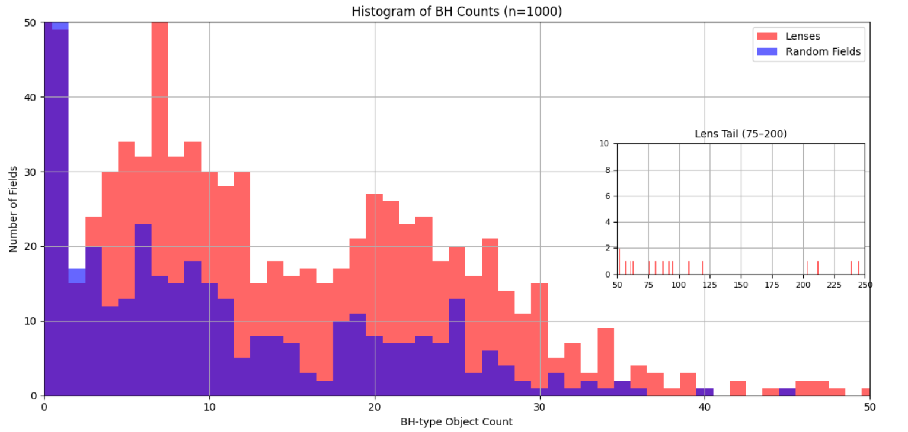
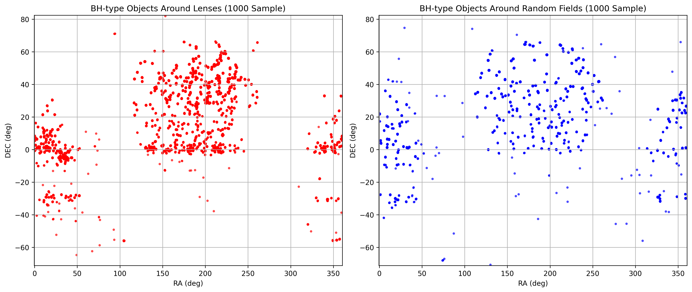
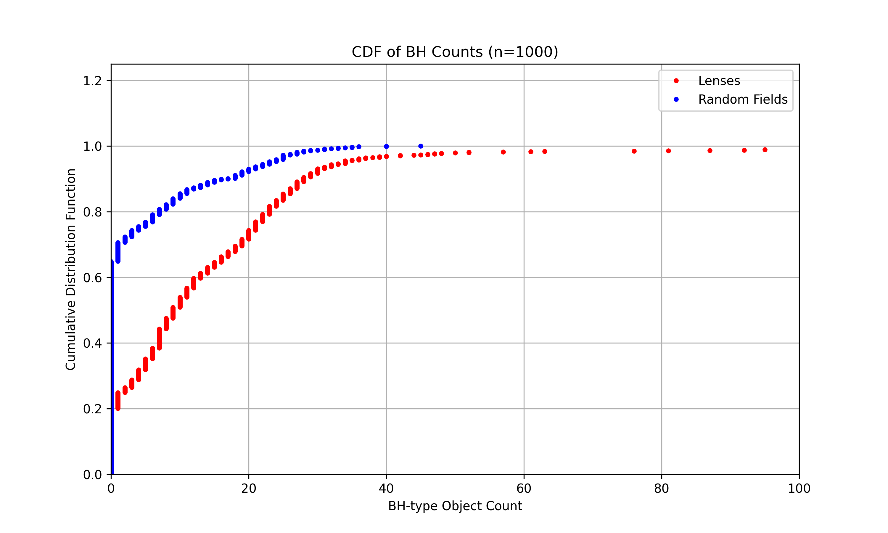
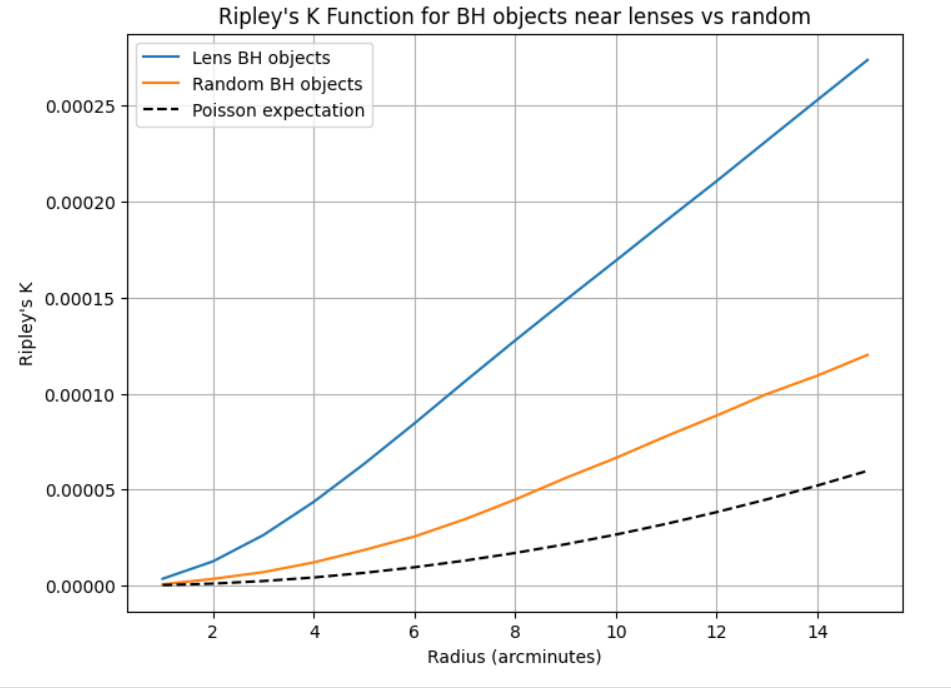

# bh_lens_simbad_analysis.py  
SIMBAD-based statistical study of black hole object associations with strong gravitational lenses

# Black Hole Association in Strong Lensing Candidates

## Overview

This project investigates the association between strong gravitational lensing candidates and black hole (BH) or BH-like objects using the SIMBAD astronomical database. We analyze a large catalog of lenses (~32,000 candidates) and compare the number of BH-type objects found near lens positions versus random sky positions.

---

## Data and Methodology

- **Lens Catalog:** Loaded directly from the `lenscat` Python package.
- **Lens Selection:** Strong lenses with grading "confident" or "probable" and a usable redshift (`zlens`).
- **Query Targets:** Objects classified as BH, BHXRB, XRB, BLAZAR, AGN, or QSO in SIMBAD.
- **Search Radii:** 10, 15, and 20 arcminutes around each lens.
- **Random Comparison:** Matched random sky coordinates generated with minimum separation from any lens to avoid overlap.
- **Batch Processing:** Lenses are processed in batches of 50 to manage query loads and allow progressive analysis.
- **Statistical Tests:** Chi-squared, binomial, Poisson, and Kolmogorov-Smirnov (KS) tests applied to assess significance of BH clustering near lenses versus random sky.

---

## Key Results

### Large-Scale SIMBAD Query (~13,941 Lenses)

Queried SIMBAD around **~13,941** confident/probable lenses with valid redshift, compared to matched random sky fields with the same number of points at radii 10′, 15′, and 20′.

| Radius     | BH in Lenses (%) | BH in Random (%) | Mean BH Count (Lens) | Mean BH Count (Random) |
|------------|------------------|------------------|---------------------|-----------------------|
| 10 arcmin  | 63.5%            | 35.4%            | 7.90                | 1.74                  |
| 15 arcmin  | 68.2%            | 40.0%            | 17.03               | 3.90                  |
| 20 arcmin  | 71.6%            | 44.0%            | 28.97               | 6.90                  |

Statistical tests (Chi-squared, Binomial, Poisson, KS) show p-values < 1e-100 for all radii, **strongly confirming** a significant excess of BH-type objects near lenses compared to random sky fields.

---

### Medium-Scale Spatial Clustering (~100 to 1500 Lenses)

For computational feasibility, subsamples of 100 to 1500 lenses were analyzed to explore spatial clustering using angular separations and Ripley’s K function:

- Retrieved full RA/DEC coordinates for BH-type objects within 20′ radius around lenses and matched random fields.
- Computed all pairwise angular separations within each group.
- Performed Ripley’s K function analysis to quantify clustering.
- Applied Kolmogorov-Smirnov tests to compare lens vs. random BH object spatial distributions.

**Example Results (100-lens sample):**

| Metric                           | Lenses         | Random Fields   |
|----------------------------------|----------------|-----------------|
| Fields with ≥1 BH-type object    | 77%            | 21%             |
| Mean BH-type object count        | 28.76          | 2.48            |
| KS test statistic (D)            | 0.22           | —               |
| KS test p-value                  | ≈ 0            | —               |

This confirms **significant clustering differences** in BH-type object spatial distribution near lenses compared to random fields.

---

## Visualizations

### 📊 Histogram: BH Counts Near Lenses vs. Random Fields



**Description:**  
Histogram comparing the number of BH-type objects per field around strong gravitational lenses (blue) and matched random sky positions (orange). Each field covers a 20′ radius. The x-axis shows BH-type object counts; the y-axis is normalized probability.  
**Key Insight:** BH-type objects occur far more frequently near lenses than in randomly selected sky regions.

---

### 🌌 Spatial Scatter Plot: BH Object Locations



**Description:**  
Scatter plot of BH-type object positions around 1000 strong lenses (left) and 1000 matched random fields (right). Each dot represents a SIMBAD-classified BH-type object within a 20′ radius of the center.  
**Key Insight:** A higher concentration of BH-type objects is evident in lens fields compared to random fields, supporting spatial correlation.

---

### 📈 Cumulative Distribution Function (CDF)



**Description:**  
Cumulative distribution of BH-type object counts in lens vs. random fields. The plot shows the fraction of fields with a BH count less than or equal to a given value.    
**Key Insight:** Lenses have a systematically higher probability of hosting multiple BH-type objects than random fields.

---

## Ripley's K Function Spatial Clustering




**Description:**  
Cumulative distribution of BH-type object counts in lens vs. random fields. The plot shows the fraction of fields with a BH count less than or equal to a given value.

**Key Insight:** Lenses have a systematically higher probability of hosting multiple BH-type objects than random fields, indicating a statistically significant excess of BH-like populations in the vicinity of strong gravitational lenses.


---

## Interpretation

These results demonstrate a significant excess and spatial clustering of BH-type objects around strong lens candidates, suggesting lenses are located in BH-rich environments. This statistical association challenges traditional dark matter halo-centric lens models and warrants further astrophysical investigation.

---

## How to Run

1. Clone this repository.
2. Install dependencies:
   ```bash
   pip install lenscat astroquery astropy scipy pandas numpy matplotlib tqdm
3.Run the main analysis script (bh_lens_simbad_analysis.py) to reproduce results.

## License
MIT License

## Contact
For questions or collaboration inquiries, please open an issue or contact [mjay10016@gmail.com].


